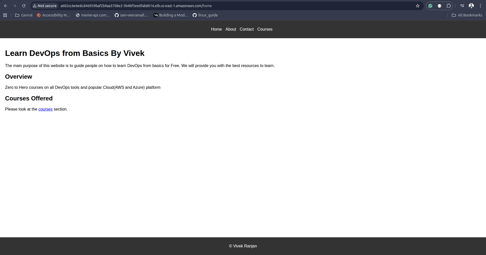
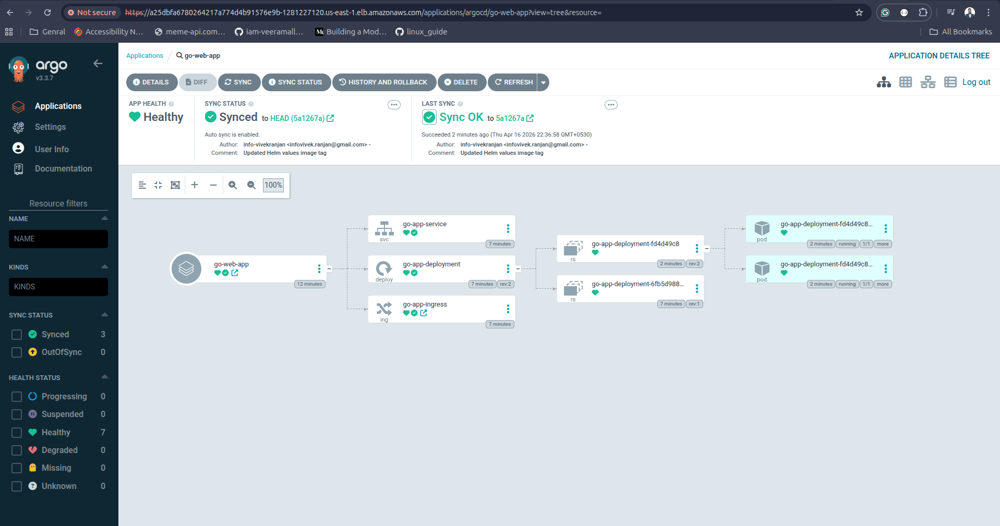

# 🚀 Go Web Application – Deployment & CI/CD Guide

This document explains how the application is containerized, deployed, and continuously delivered using a modern DevOps stack.

---

## 🧱 Architecture Overview

The application follows a **containerized deployment approach** using:

* Docker (multi-stage builds)
* Kubernetes (EKS)
* Helm (templating)
* GitHub Actions (CI)
* Argo CD (CD / GitOps)
* NGINX Ingress Controller (traffic routing)

---

## 📦 Containerization

* A **multi-stage Docker build** is used to:

  * Compile the Go binary in a builder stage
  * Copy only the final binary into a lightweight runtime image
* This reduces image size and improves security

---

## ☸️ Kubernetes Setup (EKS)

* Created an **Amazon EKS cluster** with:

  * Minimum nodes: 2
  * Maximum nodes: 2
* Ensures basic availability and scalability

---

## 📄 Kubernetes Manifests

The following resources are defined:

* **Deployment**

  * Manages application pods
  * Maintains desired replica count

* **Service (ClusterIP)**

  * Internal service used by Ingress

* **Ingress**

  * Routes external traffic to the service

---

## 🌐 Ingress Controller

* Installed **NGINX Ingress Controller**
* Handles:

  * HTTP routing
  * Reverse proxying
  * Domain/path-based access

---

## 📊 Helm Chart

* Created a custom **Helm chart** to:

  * Template Kubernetes manifests
  * Manage configuration via `values.yaml`

Example:

```yaml
image:
  repository: your-docker-repo
  tag: <dynamic-tag>
```

---

## 🖼️ Application Preview

### 🌍 Live Application



---

### ⚙️ Argo CD Deployment View



---

## 📌 Summary (CI/CD Flow)

### 🔄 Continuous Integration (CI)

Implemented using **GitHub Actions**

* Triggered on every push
* Builds Docker image
* Tags image using commit SHA or run ID
* Pushes image to container registry
* Updates Helm `values.yaml`:

```bash
sed -i "s/tag: .*/tag: \"${{ github.sha }}\"/" values.yaml
```

---

### 🚀 Continuous Deployment (CD) – Argo CD

* Installed **Argo CD** in the same EKS cluster
* Exposed using a **LoadBalancer service**

**How it works:**

* Continuously monitors Helm repository
* Detects changes (e.g., updated image tag)
* Automatically syncs cluster state
* Deploys latest version to Kubernetes

---

### 🔁 End-to-End Flow

1. Developer pushes code to GitHub
2. GitHub Actions:

   * Builds Docker image
   * Pushes to registry
   * Updates Helm chart
3. Argo CD detects changes
4. Argo CD deploys to EKS
5. Application becomes accessible via Ingress

---
